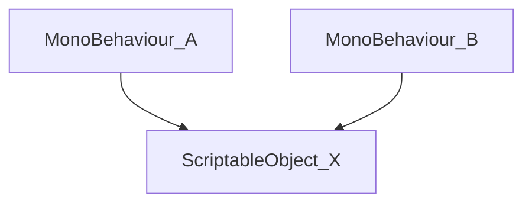

# Simple Atom for Unity

## Introduction

We can use Unity ScriptableObjects (SOs) to store data in a game project, following a Data Driven architecture. Thus, a MonoBehaviour script A do not need depend on another MonoBehaviour B. They can use the data that are stored in a SO X. On the Unity Editor, all scripts that need any information stored in X, can reference this using a property and can be configured already in a prefab.

## References
- [How to make your code more Modular using Scriptable Objects in Unity](https://www.youtube.com/watch?v=6deqAk3jypo)
- [Three ways to architect your game with ScriptableObjects](https://unity.com/how-to/architect-game-code-scriptable-objects)