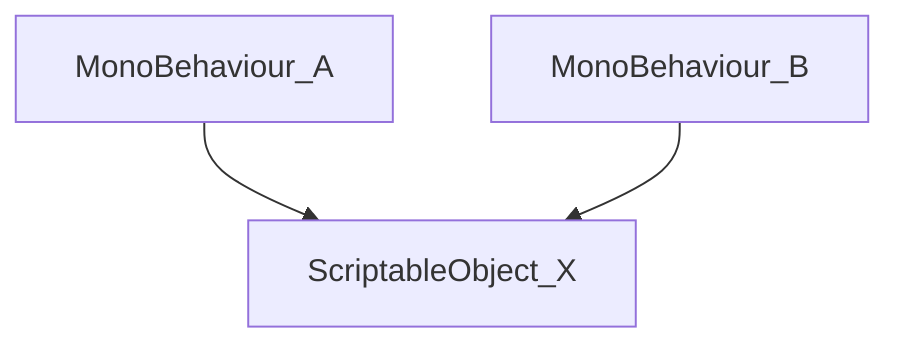

# Simple Atom for Unity

## Introduction

We can use Unity ScriptableObjects (SOs) to store data in a game project, following a Data Driven architecture. Thus, a MonoBehaviour script A do not need depend on another MonoBehaviour B. They can use the data that are stored in a SO X. On the Unity Editor, all scripts that need any information stored in X, can reference this using a property and can be configured already in a prefab.




## How to work Simple Atom (SA) lib

The Simple Atom (SA) is divided in 3 types of classes: variables, events, listeners. The listeners are subdivided in two subtypes: variable listeners and event listeners.

## Variables

We create the main variable types used in Unity, but you can create all others types that you need. We create the types:
- IntVariable
- FloatVariable
- BoolVariable
- StringVariable
- GameObjectVariable

They inherit from BaseVariable class. Below how the IntVariable is defined:
```csharp
[CreateAssetMenu(menuName = "SimpleAtoms/Variables/Int")]
public class IntVariable : BaseVariable<int>
{
}
```

To create a custom Variable Class, you need follow the steps
- the custom class needs to intherit from BaseVariable and change the type between <type> to its own type.
- the menuName must be changed

So, the Custom class will be thus:
```csharp
[CreateAssetMenu(menuName = "SimpleAtoms/Variables/Custom")]
public class CustomVariable : BaseVariable<Custom>
{
}
```


## References
- [How to make your code more Modular using Scriptable Objects in Unity](https://www.youtube.com/watch?v=6deqAk3jypo)
- [Three ways to architect your game with ScriptableObjects](https://unity.com/how-to/architect-game-code-scriptable-objects)